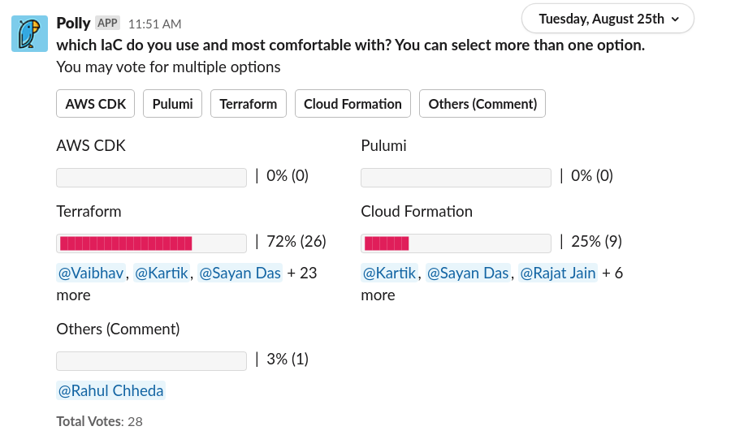
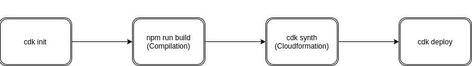
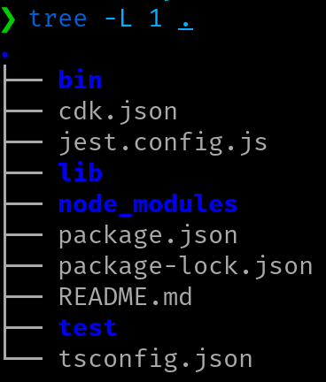

# Agenda
- Introduction
- How it works?
- Pros & Cons
- Demo

# Poll Result



# Introduction
- AWS **Cloud Development Kit**(CDK) is an infrastructure-as-code framework to model the cloud application and resources using familier programming languages.
- Provides preconfigure components with proven defaults.
- Accelerate development: Use the power of programming language like objects, loops, and conditions
- Currently supports TypeScript, Python, Java, .NET. 
- Generates CloudFormation under-the-hood.
- Good for modularity, sharing common constructs across organisation.

# CDK vs CloudFormation/SAM

- AWS SAM works only for serverless, CDK is for all AWS services.
- CDK ultimately creates CloudFormation under the hood.
- CDK is good for modeling the cloud infrastructure.
- Cloudformation becomes messy and unproductive with growing number of components. 

## Other Similar Projects
- Pulumi


# How it works?
## Prerequisites
- AWS CLI, AWS Account and Programmatic Access
- Node.js (>=10.3.0)
- Your favourite IDE (VS Code recommended)
- AWS CDK (`npm install -g aws-cdk`)
- Programming language environment that you want to use.

## Workflow


# Crash course

- `cdk init app --language typescript` -- Initialize project in typescript



---

* **lib/** - has the main stack 
* **bin/** - entrypoint of the CDK app
* **package.json** - npm module manifest
* **cdk.json** - tells the toolkit, how to run your app (`npx ts-node bin/sample-cdk-nodejs.ts`)
* **node_modules** - all your project depedencies  

# Crash Course ...

### bin/sample-cdk-nodejs.ts
```typescript
#!/usr/bin/env node
import * as cdk from '@aws-cdk/core';
import { SampleCdkNodejsStack } 
from '../lib/sample-cdk-nodejs-stack';

const app = new cdk.App();
new SampleCdkNodejsStack(app, 'SampleCdkNodejsStack');

```

# Crash Course ...

### lib/sample-cdk-nodejs-stack
```typescript
import * as sns from '@aws-cdk/aws-sns';
import * as subs from '@aws-cdk/aws-sns-subscriptions';
import * as sqs from '@aws-cdk/aws-sqs';
import * as cdk from '@aws-cdk/core';

export class SampleCdkNodejsStack extends cdk.Stack {
  constructor(scope: cdk.App, id: string, props?: cdk.StackProps) {
    super(scope, id, props);

    const queue = new sqs.Queue(this, 'SampleCdkNodejsQueue', {
      visibilityTimeout: cdk.Duration.seconds(300)   
    });

    const topic = new sns.Topic(this, 'SampleCdkNodejsTopic');
    topic.addSubscription(new subs.SqsSubscription(queue));
  }
}
```

# Continued ...

* `npm run build` - compiles the code to js
* `cdk synth` - creates the *CloudFormation* templates
* `cdk bootstrap` - It bootstraps the stack by creating s3 bucket and pushing the templates to s3. 
* `cdk deploy` - Deploy the stack
* `cdk destroy` - destroy the stack
 
# Pros and Cons

## Pros
- Elegant programmatic model
- Extensible and modular, promotes reusability
- predictable and repeatable 
- Less code, more work
- Possible to import existing CloudFormation templates
- Native to AWS, better support
- Solution Constructs - Best practices, well architected patterns

## Cons
- Works only with AWS
- Need to have programming skills

# What to do next?
- Head up to [cdkworkshop.com](cdkworkshop.com) and try basic constructs in your preferred language
- Utilize patterns and libraries given at _[Solution Constructs](https://aws.amazon.com/solutions/constructs/)_
- Explore _[Samples on Github](https://github.com/aws-samples/aws-cdk-examples)_ 
- [CDK API Documentation](https://docs.aws.amazon.com/cdk/api/latest/docs/aws-construct-library.html)

# Thank you

## Questions?
